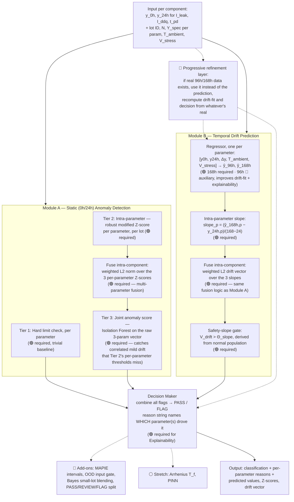

# Component Burn-In Predictive Screening — Architecture v3 (Post-Council Review)

This revises v1 after reviewing five design decisions against the problem statement. Net effect: **multi-parameter fusion and the joint (Isolation Forest) anomaly layer move from "add-on" to "required"**; **96h joins 168h as an auxiliary forecast target**; and a **progressive-refinement input layer** (prefer real data over predictions wherever available) is added as a labeled 🔵 add-on. Everything else keeps its original status.

**Legend**
- 🟢 **REQUIRED** — directly named in the problem statement, implicitly required by an evaluation metric, or now required by council review
- 🔵 **ADD-ON** — strengthens a required piece, not asked for
- ⚪ **STRETCH** — build only if time remains

---

## 0. Naming and Scope — read this before presenting the project

**This is a predictive *screening* system, not a predictive *maintenance* system.** The two are easy to conflate once forecasting and early flagging are in the picture, but they answer different questions:

| | Predictive screening (this project) | Predictive maintenance (a different problem) |
|---|---|---|
| When it runs | During manufacturing test, before a part ships | On deployed, operating equipment, throughout its working life |
| Question it answers | "Will this part pass, before I finish the full 168h test?" | "When will this already-shipped part fail, so I can service it first?" |
| Scope | Ends the moment a part passes or is flagged at test time | Continuous, for the part's entire operational lifetime |

This system never follows a part past the burn-in chamber — once it passes or is flagged, its job is done. That's screening, correctly scoped. Use "predictive screening" or "early-exit screening" in any pitch or write-up; "predictive maintenance" describes a larger problem this project was never asked to solve.

**Why prediction isn't overkill despite four named checkpoints (0h/24h/96h/168h):** the Background text's own justification — *"running every part for the full duration is slow and expensive"* — is the entire reason the project exists. The four checkpoints describe two different things, not one:
- **Training data:** historical components run the *full* 168h, all four points measured, so the model has real trajectories to learn "drift toward failure" from.
- **Inference input:** Module B's own spec line — *"takes Value_0h and Value_24h as inputs and forecasts Value_168h"* — is deliberately narrower. At decision time you only have the first two points; that's exactly why forecasting the rest is the task, not an unnecessary addition.

State this distinction proactively when presenting — it pre-empts the most likely judge question about the four checkpoints.

---

## 1. What changed, and why

| Decision reviewed | v1 status | v2 status | Why it moved |
|---|---|---|---|
| Input = 0h/24h only, forecast 168h | 🟢 required | 🟢 required (unchanged) | Module B's spec sentence explicitly names these three points; confirmed correct |
| Multi-parameter fusion (Iddq + leakage + t_pd together, not one at a time) | 🔵 add-on | 🟢 **required** | Background's own definition of "latent defect" — drift invisible to single-parameter limits — only exists as a *cross-parameter* phenomenon. A single-parameter model cannot detect the exact failure mode the spec defines. |
| Isolation Forest / joint multi-parameter anomaly score (Tier 3) | 🔵 add-on | 🟢 **required** | This is the direct fix for the hierarchical design's blind spot: three parameters each mildly drifting in the same direction can each individually stay under a per-parameter Z-threshold. Only a joint score catches that. Without it, the false-negative risk the eval metric penalizes most is structurally unaddressed. |
| Hierarchical structure (per-parameter score → fuse to per-component score), same shape for both static and temporal layers | n/a | 🟢 required, **but only as the primary/explainable path — must sit alongside the joint layer above, not instead of it** | Keeps per-parameter attribution for the QA-inspector explanation; the joint layer covers what it misses |
| Forecast intermediate checkpoints, not just 168h | ⚪ stretch (arbitrary 48/72/96h in v1) | 🔵 **add-on, but retarget to 96h only** | Background text names 0h/24h/**96h**/168h as the real measured intervals — 96h is the one checkpoint actually in the spec. Predicting it improves the drift-fit and explainability, but the graded metric is 168h MAE only, so 96h stays auxiliary, not a second deliverable. Arbitrary points (60h/132h) are dropped — nothing in the spec measures there. |
| System behavior when a user already holds real 96h/168h data | n/a | 🔵 **add-on — progressive refinement layer** | Real measured values should always override predictions for that checkpoint, with downstream decisions recomputed from whichever mix of real+predicted data currently exists. Strong deployment-maturity story, but the graded task only ever supplies 0h/24h (168h is hidden ground truth), so this doesn't affect your score — build after the required path works. |

Everything not in this table (MAPIE intervals, OOD gate, Empirical Bayes small-lot blending, Arrhenius `Tf`, PINN) is unchanged from v1 — still 🔵/⚪, build after the core loop works.

---

## 2. Redesigned Architecture



**The key structural change from v1:** both Module A and Module B now run the *same two-stage pattern* — intra-parameter analysis first (for explainability), fused intra-component with a weighted L2 norm (for detecting compound drift), **plus an independent joint check** (Isolation Forest for Module A) that doesn't go through the per-parameter decomposition at all, specifically so a defect that no single parameter's threshold catches still gets caught by the joint view.

---

## 3. Revised Implementation Order

The order changes from v1 mainly in Phase 2 and Phase 3: multi-parameter fusion and the joint anomaly layer are no longer deferred to "Phase 6+" — they're built inline, in the same pass as the per-parameter logic, because they're now part of the required path.

### Phase 0 — Setup (unchanged)

```bash
pip install pandas numpy scikit-learn xgboost scipy
```

### Phase 1 — Data (🟢 required)

Same as v1, but the table must now be **wide across all three parameters** per component, not one CSV per parameter — the fusion steps need all three in the same row.

```python
import numpy as np, pandas as pd

rng = np.random.default_rng(42)
n = 500
params = ["I_leak", "I_ddq", "t_pd"]

df = pd.DataFrame({"lot_id": rng.integers(1, 11, n), "T_ambient": 125.0,
                    "V_stress": rng.choice([3.3, 5.0], n)})

# generate 0h/24h/168h per parameter, with a shared subset of components
# defective across ALL THREE params only mildly per-parameter (the compound case)
defect_idx = rng.choice(n, size=int(0.05 * n), replace=False)
df["is_defect"] = np.isin(np.arange(n), defect_idx)

for p in params:
    y0h = rng.normal(10, 0.5, n)
    y24h = y0h * 1.02 + rng.normal(0, 0.3, n)
    lam = np.log(y24h / y0h) / 24
    y168h = y0h * np.exp(lam * 168)
    # compound case: mild simultaneous drift across all 3, none individually extreme
    lam_d = lam[defect_idx] * rng.uniform(1.4, 1.8, len(defect_idx))
    y168h[defect_idx] = y0h[defect_idx] * np.exp(lam_d * 168)
    df[f"{p}_0h"], df[f"{p}_24h"], df[f"{p}_168h"] = y0h, y24h, y168h

df.to_csv("burnin_data.csv", index=False)
```

Note the defect injection here is deliberately *mild per parameter* — this is the compound-drift case the council flagged, and it's the case that should fail a single-parameter-only design and pass a fused one. Use it as your own internal test of whether the fusion step is doing its job before you trust the pipeline.

### Phase 2 — Module A: Static Anomaly Detection, full stack (🟢 required)

**Tier 1 — hard limits**, per parameter (unchanged from v1):

```python
Y_spec = {"I_leak": 50.0, "I_ddq": 5.0, "t_pd": 20.0}   # example limits
for p in params:
    df[f"{p}_hard_flag"] = df[f"{p}_24h"] >= Y_spec[p]
```

**Tier 2 — intra-parameter Z-score**, per parameter, per lot:

```python
def modified_z(vals):
    med = np.median(vals)
    mad = np.median(np.abs(vals - med))
    return 0.6745 * (vals - med) / max(mad, 1e-6)

for p in params:
    df[f"{p}_z"] = df.groupby("lot_id")[f"{p}_24h"].transform(modified_z)
```

**Fuse intra-component — weighted L2 norm** (this is the step that makes multi-parameter fusion real, not just three separate checks):

```python
weights = {"I_leak": 1.0, "I_ddq": 1.0, "t_pd": 1.0}   # tune later; equal to start
df["z_fused"] = np.sqrt(sum(weights[p] * df[f"{p}_z"]**2 for p in params))
df["static_outlier_flag"] = df["z_fused"] > 3.5
```

**Tier 3 — joint Isolation Forest** (the required addition — run on the raw per-parameter Z-vector, not a single scalar, so it can catch correlation the L2 fusion's fixed weights might under-weight):

```python
from sklearn.ensemble import IsolationForest

z_matrix = df[[f"{p}_z" for p in params]]
iso = IsolationForest(contamination=0.05, random_state=0)
df["joint_anomaly_score"] = -iso.fit(z_matrix).score_samples(z_matrix)  # higher = more anomalous
df["joint_outlier_flag"] = iso.predict(z_matrix) == -1
```

Validate this phase specifically against the compound-defect rows you injected in Phase 1 — if `z_fused` alone misses them but `joint_outlier_flag` catches them (or vice versa), that tells you which layer is actually earning its place, and whether the L2 weights need tuning.

### Phase 3 — Module B: Drift Prediction, full stack (🟢 required)

**Regressor, per parameter** (multi-output in spirit — train one model per parameter so each keeps its own MAE, which is what gets graded per-parameter anyway):

```python
from xgboost import XGBRegressor
from sklearn.model_selection import train_test_split
from sklearn.metrics import mean_absolute_error

models = {}
for p in params:
    df[f"{p}_delta"] = df[f"{p}_24h"] - df[f"{p}_0h"]
    X = df[[f"{p}_0h", f"{p}_24h", f"{p}_delta", "T_ambient", "V_stress"]]
    y = df[f"{p}_168h"]
    X_train, X_test, y_train, y_test = train_test_split(X, y, test_size=0.2, random_state=0)

    m = XGBRegressor(n_estimators=200, max_depth=4, learning_rate=0.1)
    m.fit(X_train, y_train)
    models[p] = m
    print(p, "MAE:", mean_absolute_error(y_test, m.predict(X_test)))

    df[f"{p}_168h_pred"] = m.predict(X)
```

**Intra-parameter slope**, per parameter:

```python
for p in params:
    df[f"{p}_slope"] = (df[f"{p}_168h_pred"] - df[f"{p}_24h"]) / (168 - 24)
```

**Fuse intra-component — weighted L2 drift vector** (same fusion pattern as Module A, applied to slopes instead of Z-scores):

```python
slope_std = {p: df.loc[~df["static_outlier_flag"], f"{p}_slope"].std() for p in params}
for p in params:
    df[f"{p}_slope_norm"] = df[f"{p}_slope"] / (slope_std[p] + 1e-6)

df["v_drift"] = np.sqrt(sum(weights[p] * df[f"{p}_slope_norm"]**2 for p in params))
```

**Safety-slope gate**, derived from the normal population (not hardcoded):

```python
normal_drift = df.loc[~df["static_outlier_flag"], "v_drift"]
theta_slope = normal_drift.median() + 3 * normal_drift.mad()
df["drift_flag"] = df["v_drift"] > theta_slope
```

### Phase 4 — Decision Maker (🟢 required, now names which parameter(s) fired)

```python
def decide(row):
    hard_hits = [p for p in params if row[f"{p}_hard_flag"]]
    if hard_hits:
        return "FLAG", f"Hard limit violated on: {', '.join(hard_hits)}."
    if row["joint_outlier_flag"]:
        top = max(params, key=lambda p: abs(row[f"{p}_z"]))
        return "FLAG", f"Joint multi-parameter anomaly (score {row['joint_anomaly_score']:.2f}); led by {top}."
    if row["static_outlier_flag"]:
        top = max(params, key=lambda p: abs(row[f"{p}_z"]))
        return "FLAG", f"Fused lot-relative outlier (z={row['z_fused']:.1f}); driven mainly by {top}."
    if row["drift_flag"]:
        top = max(params, key=lambda p: abs(row[f"{p}_slope_norm"]))
        return "FLAG", f"Predicted drift vector {row['v_drift']:.2f} exceeds safety threshold {theta_slope:.2f}; driven mainly by {top}."
    return "PASS", "Within limits, lot-normal, no joint anomaly, drift within safety bounds."

df[["decision", "reason"]] = df.apply(lambda r: pd.Series(decide(r)), axis=1)
```

Naming the driving parameter in every FLAG reason is what turns the fusion math back into something a QA inspector can act on — without it, "z_fused = 4.2" is still a black-box number.

### Phase 5 — Validate (🟢 required, unchanged purpose, now check the compound case specifically)

```python
from sklearn.metrics import confusion_matrix
cm = confusion_matrix(df["is_defect"], df["decision"] == "FLAG")
print(cm)  # bottom-left = false negatives — check this first

# specifically check the compound-defect rows from Phase 1
compound_check = df[df["is_defect"]]["decision"].value_counts()
print(compound_check)
```

### Phase 6+ — Remaining add-ons, priority order

1. 🔵 **96h auxiliary forecast.** Retrain each parameter's regressor as multi-output `[ŷ_96h, ŷ_168h]` instead of single-output. Use `ŷ_96h` only to improve the drift-fit and to add a trajectory line to the explanation string — never validate against it, since it isn't graded:
   ```python
   from sklearn.multioutput import MultiOutputRegressor
   y_multi = df[[f"{p}_96h", f"{p}_168h"]]   # requires 96h in training data
   m = MultiOutputRegressor(XGBRegressor(n_estimators=200, max_depth=4))
   m.fit(X_train, y_multi.loc[X_train.index])
   ```
2. 🔵 **Progressive refinement layer.** A thin input-preprocessing function that runs before Module B: for each parameter, if a real measured value exists at 96h or 168h, use it in place of the prediction and refit the drift calculation from the richer point set. Framed as a "what happens as more real data arrives during the 168h test window" feature — build this once the core required path is validated, not before:
   ```python
   def resolve_checkpoint(row, param, horizon, predicted_value):
       real_col = f"{param}_{horizon}h_actual"
       if real_col in row and pd.notna(row[real_col]):
           return row[real_col], "measured"
       return predicted_value, "predicted"
   ```
3. 🔵 MAPIE conformal intervals on each parameter's regressor
4. 🔵 OOD gate on regression inputs (separate from Tier 3, which runs on Z-scores not raw inputs)
5. 🔵 Empirical Bayes blending for small lots (`w = N/(N+30)`) in Tier 2
6. 🔵 Split `FLAG` into `FLAG`/`REVIEW` once interval width and OOD score exist
7. ⚪ Arrhenius `T_f` estimate, PINN

---

## 4. Evaluation Checklist (unchanged from v1)

| Metric | What satisfies it | Where |
|---|---|---|
| Anomaly Detection Score (false negatives catastrophic) | Low/zero false negatives, **including on the compound-defect rows** | Module A Tier 2+3 fused, + Module B drift gate |
| Drift Prediction Accuracy (MAE on 168h) | Per-parameter MAE printed in Phase 3 | Module B regressors |
| Explainability | Reason string naming the specific parameter(s) and score that fired | Phase 4 decision maker |

The compound-defect check in Phase 5 is the one addition worth treating as non-negotiable before calling this "done" — it's the direct test of whether today's council review actually closed the gap it was meant to close.
