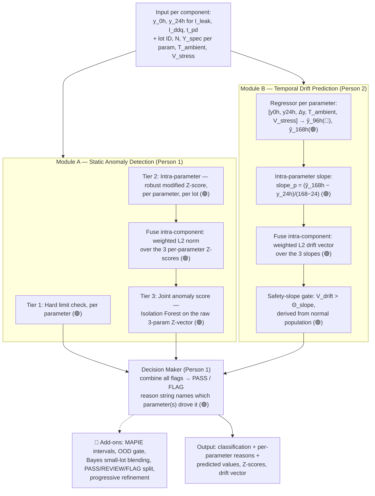

## 1. Project Abstract

High-reliability sectors (e.g. space) subject electronic components to Burn-In testing — running them at elevated temperature/voltage (e.g. 125°C) for up to 168 hours to force early-life failures to reveal themselves before parts ship. Running every part the full duration is slow and expensive, and static pass/fail limits alone miss **latent defects**: components that stay inside absolute limits but show subtle, anomalous drift over time.

This project builds a predictive **screening** system (not predictive maintenance — see §1a) that, given only a component's 0h and 24h readings across three parameters (leakage current `I_leak`, standby current `I_ddq`, propagation delay `t_pd`) plus stress context, does two things:

- **Module A — Dynamic Outlier Detection:** flags components that are statistical outliers relative to their own lot, even when inside datasheet limits.
- **Module B — Drift Prediction:** forecasts each parameter's value at 168h and flags components whose predicted drift rate exceeds a calculated safety slope — i.e. rejects early, before the full 168h test completes.

Both flags, plus a plain-language reason, are combined into a final PASS/FLAG decision so a QA inspector can audit exactly why any part was rejected.

### 1a. Why "predictive screening," not "predictive maintenance"

| | Predictive screening (this project) | Predictive maintenance (a different problem) |
|---|---|---|
| When it runs | During manufacturing test, before a part ships | On deployed, operating equipment, over its working life |
| Question answered | "Will this part pass, before the full 168h test finishes?" | "When will this shipped part fail, so it can be serviced first?" |
| Scope | Ends the moment a part passes or is flagged at test time | Continuous, for the part's entire operational life |

The system never follows a part past the burn-in chamber. Prediction exists because *"running every part for the full duration is slow and expensive"* — not because this is a monitoring platform for deployed hardware.

### 1b. Two data roles, not a contradiction

The problem statement names four checkpoints (0h/24h/96h/168h). These serve two different roles:
- **Training data:** historical components run the *full* 168h, all four points measured — this is where the model learns what drift-toward-failure looks like.
- **Inference input:** at decision time, only 0h and 24h are ever available (168h is the hidden ground truth used to grade `Drift Prediction Accuracy`). Forecasting the rest is the actual task, not an unnecessary addition.

---

## 2. Features Used and Reasoning

🟢 REQUIRED (named in the problem statement, or implied by an evaluation metric) · 🔵 ADD-ON (strengthens a required piece) · ⚪ STRETCH (build only if time remains)

| Feature | Module | Status | Reasoning |
|---|---|---|---|
| Hard datasheet limit check | A, Tier 1 | 🟢 | Baseline; catches obvious violations |
| Robust modified Z-score (median/MAD), per parameter, per lot | A, Tier 2 | 🟢 | The actual "dynamic outlier" ask — flags a 45µA part in a 10µA-average lot even though 45 < the 50µA absolute limit |
| Weighted L2 fusion of per-parameter Z-scores into one component score | A | 🟢 | Multi-parameter fusion — required because "latent defect" (Background) is defined as drift invisible to any single parameter's limit |
| Isolation Forest on the joint Z-vector | A, Tier 3 | 🟢 | Catches compound drift where each parameter individually stays under its Z-threshold but all three move together — the direct fix for the false-negative blind spot in Tier 2 alone |
| XGBoost regressor, 0h/24h/context → 168h | B | 🟢 | Exactly Module B's spec sentence; this is what "Drift Prediction Accuracy" (MAE) grades |
| Safety-slope calculation + gate, derived from the normal population | B | 🟢 | Exactly the flagging rule in the problem statement — "if predicted drift rate exceeds a calculated safety slope, flag for early rejection" |
| Weighted L2 fusion of per-parameter slopes into one drift vector | B | 🟢 | Same multi-parameter reasoning as Module A, applied to drift instead of static values |
| Decision Maker with per-parameter reason string | A+B → Decision | 🟢 | Directly required by the "Explainability" evaluation metric — an unexplained flag fails this criterion outright |
| 96h auxiliary forecast | B | 🔵 | 96h is the one intermediate checkpoint actually named in the Background text; improves the drift-fit and the explanation trail. Never validated against — only 168h is graded |
| MAPIE conformal prediction intervals | B | 🔵 | Turns a point guess into a calibrated range; strengthens both Explainability and the false-negative defense on out-of-distribution parts |
| OOD gate (Isolation Forest on raw regression inputs) | B | 🔵 | Forces REVIEW instead of a confident wrong guess on failure physics never seen in training |
| Empirical Bayes small-lot blending | A, Tier 2 | 🔵 | Report's own design challenge: Z-score statistics break down for lots under ~30 units; blends lot stats with historical part-number priors |
| PASS/REVIEW/FLAG (vs plain PASS/FLAG) | Decision | 🔵 | Defers uncertain cases to a human instead of forcing a guess, once interval width / OOD score exist |
| Progressive refinement (prefer real 96h/168h data over predictions when available) | Input layer | 🔵 | Deployment-maturity feature; the graded task never supplies this, so it doesn't affect score |
| Arrhenius/exponential time-to-failure estimate | B | ⚪ | Good demo material, not graded |
| Physics-Informed Neural Network alternative | B | ⚪ | High effort, low marginal grading benefit; only if the 🟢 path is solid with time to spare |

---

## 3. Complete Project Architecture



---

## 4. Integration Contract — identical in both teammates' documents, do not change unilaterally

This is the interface both of you build against. If either person's module changes its output column names or function signature, the other person's code breaks — so treat this section as frozen once you start coding, and if it must change, agree on the change together and update it in **both** documents at the same time.

### 4a. File / module boundaries

```
burnin_screening/
  data/
    generate_data.py      # shared — write once together, freeze after first commit
    burnin_data.csv
  module_a_static.py      # Person 1 owns — Person 2 never edits this file
  module_b_temporal.py    # Person 2 owns — Person 1 never edits this file
  decision_maker.py       # Person 1 owns — reads Module B's output contract, never Module B's internals
  validate.py             # Person 1 owns
  main.py                 # Person 1 owns — integration entrypoint, calls both modules
```

Each module exposes **exactly one public function** with a fixed signature. Neither of you needs to read the other's internals — only call the function and use the documented output columns.

### 4b. Shared input schema (frozen from Phase 1, both modules read this, neither writes to it)

Per component row: `component_id, lot_id, N, T_ambient, V_stress`, and per parameter `p` in `{I_leak, I_ddq, t_pd}`: `{p}_0h, {p}_24h, Y_spec_{p}`.

Training-only columns (never present at inference, only for building/validating models): `{p}_96h, {p}_168h, is_defect`.

### 4c. Module A's output contract (Person 1 → Decision Maker)

```python
def run_module_a(df, Y_spec: dict, params: list) -> pd.DataFrame:
    """
    Returns df with these columns ADDED (never removes/renames input columns):
      {p}_hard_flag        bool   — per parameter, Tier 1
      {p}_z                float  — per parameter, Tier 2
      z_fused               float  — fused intra-component Z (weighted L2)
      static_outlier_flag   bool   — z_fused > threshold
      joint_anomaly_score   float  — Tier 3, higher = more anomalous
      joint_outlier_flag    bool   — Tier 3 Isolation Forest verdict
    """
```

### 4d. Module B's output contract (Person 2 → Decision Maker)

```python
def run_module_b(df, params: list, train: bool = True, with_intervals: bool = False):
    """
    Returns (df, models, theta_slope) where df has these columns ADDED:
      {p}_96h_pred          float  — auxiliary forecast (🔵, never validated against)
      {p}_168h_pred         float  — required forecast (🟢, graded via MAE)
      {p}_168h_lower        float  — MAPIE 95% lower bound (🔵, only with with_intervals=True)
      {p}_168h_upper        float  — MAPIE 95% upper bound (🔵, only with with_intervals=True)
      {p}_slope             float  — per parameter
      {p}_slope_norm        float  — normalized by the normal population's slope std
      v_drift                float  — fused intra-component drift vector (weighted L2)
      drift_flag             bool   — v_drift > theta_slope
    models: dict[param -> fitted regressor], for reuse without retraining
    theta_slope: the safety-slope threshold (Prompt B2 step 4), returned for
      logging/reuse by the Decision Maker
    theta_k (additive, default 3.0 = Prompt B2's literal spec): the MAD
      multiplier in theta_slope = median + theta_k * MAD over the normal
      population. TEAM-TUNED VALUE: main.py's demo entrypoint ships 2.4 —
      a joint grid over Module A's z_threshold/contamination and this
      multiplier showed the drift gate is the only effective FN lever on
      the compound-defect case (see person1 doc §8 step 6); 3.0 remains the
      spec default here so the required path is unchanged by default.
    theta_blended (additive, default False; Phase 1 report §8b): derive
      theta_slope PER LOT reusing Module A's small-lot Empirical Bayes
      pattern (w = N/(N+30)): lot_theta = w * (lot median + theta_k * lot
      MAD) + (1 - w) * (global median + theta_k * global MAD), all over the
      normal population. When True, run_module_b returns
      dict[lot_id -> theta] as its third element and drift_flag uses each
      row's own lot's theta; small lots shrink toward the global prior
      instead of getting a noise-driven gate. Default False keeps the
      single global theta_slope (required path unchanged); stress-level
      stratification (V_stress/T_ambient grouping) is a documented TODO —
      the synthetic generator's physics does not vary with stress yet.
    with_intervals=True (🔵 Prompt B3): fits a MAPIE conformal wrapper
      (CrossConformalRegressor, method="plus", cv=5, confidence_level=0.95 —
      the MAPIE>=1.0 successor of MapieRegressor) for the 168h target
      specifically; {p}_168h_pred then comes from that wrapper. Default False
      — the required path is unchanged.
    Also exposes these helpers (not part of the merge contract):
      build_ood_features(df, params) -> raw-feature matrix (combined set:
        every parameter's {p}_0h/{p}_24h/{p}_delta plus T_ambient, V_stress once)
      fit_ood_gate(X_train, contamination=0.05) -> IsolationForest on RAW
        inputs (not Z-scores — those belong to Module A's Tier 3)
      score_ood(detector, X) -> (ood_score, ood_flag); ood_score =
        -score_samples (higher = more anomalous), ood_flag = predict() == -1
      resolve_checkpoint(row, param, horizon, predicted_value)
        -> (value, "measured" | "predicted") — standalone (Prompt B5),
        deliberately NOT wired into run_module_b
    """
```

### 4e. Merge rule

`main.py` (Person 1) calls both functions on the **same** input dataframe and joins on `component_id` — never on row position, in case either module reorders rows:

```python
df_a = module_a_static.run_module_a(df_input, Y_spec, params)
df_b, models_b = module_b_temporal.run_module_b(df_input, params, train=True)
df_full = df_a.merge(df_b[["component_id"] + module_b_new_cols], on="component_id")
```

Any change to either contract (new column, renamed column, changed meaning) must be reflected in this section in **both** documents before the other person's code is written against it.

### 4f. Decision contract (Decision Maker's inputs/outputs — Person 1)

```python
def decide(df, params, theta_slope: float, theta_width: float | None = None,
           Y_spec: dict | None = None):
    """
    Returns df with two columns ADDED:
      decision             str    — "PASS" | "REVIEW" | "FLAG"
      reason               str    — plain-language, always names the parameter(s)
    Priority order (first match wins):
      1. any {p}_hard_flag        -> FLAG   (Tier 1, measured 24h)
      2. {p}_168h_pred >= Y_spec[p] with a narrow interval -> FLAG (predicted
         168h breach — §8a of the Phase 1 report; independent of the drift
         gate. "Narrow" = the parameter's relative interval width is <=
         theta_width; with intervals off/theta_width=None every predicted
         breach is flaggable. Inert without Y_spec.)
      3. joint_outlier_flag       -> FLAG   (Tier 3)
      4. static_outlier_flag      -> FLAG   (fused lot outlier)
      5. drift_flag               -> FLAG   (safety-slope breach)
      6. ood_flag                 -> REVIEW (OOD inputs — predictions untrustworthy)
      7. widest relative 168h interval > theta_width -> REVIEW (low confidence)
      8. otherwise                -> PASS
    Team decision (Phase 3): REVIEW NEVER OVERRIDES FLAG — the uncertainty
    signals (5/6) only defer rows that would otherwise PASS. Conservative for
    false negatives, which the eval metric penalizes most.
    Consumes (all optional beyond the §4c/§4d minimum — absence degrades, never
    crashes and never creates a REVIEW):
      ood_flag, ood_score            — attached by main.py (Prompt B4 helpers,
                                       combined feature set, one verdict/component)
      Y_spec                         — dict[param -> datasheet limit] enabling
                                       branch 2 (predicted 168h breach, §8a);
                                       None/{} leaves the branch inert — absence
                                       degrades to the Phase 3 7-branch behavior,
                                       never crashes and never creates a FLAG
      {p}_168h_lower/{p}_168h_upper  — Module B's MAPIE intervals (with_intervals=True)
      theta_width                    — interval-width REVIEW threshold
    theta_width derivation (main.derive_theta_width, same philosophy as
    theta_slope — derived, not hardcoded): median + 3*MAD of the per-row MAX
    relative interval width over the NORMAL population (static_outlier_flag
    == False), where relative width = ({p}_168h_upper - {p}_168h_lower) /
    |{p}_168h_pred| (scale-free: comparable across uA/mA/ns parameters).
    main.py also exposes max_relative_width(df, params) (decision_maker) for
    this derivation — single source of the width formula.
    Degradation guarantees: no ood_flag -> branch 5 inert; no intervals or
    theta_width=None -> branch 6 inert; result is then the binary PASS/FLAG
    of the required path, byte-identical semantics.
    """
```

Pipeline wiring (main.run_pipeline, all 🔵 add-ons default True, each independently
switchable): `with_intervals` (Prompt B3 intervals + branch 7), `with_ood` (Prompt B4
helpers + branch 6), `theta_blended` (§8b per-lot Empirical-Bayes theta_slope, default
False — the global theta stays the required-path default), `with_progressive_refinement`
— reads `{p}_{h}h_actual` columns
(Prompt B5 naming) when present, prefers measured over predicted per row, recomputes
`{p}_slope`/`{p}_slope_norm`/`v_drift`/`drift_flag` from the refined mix (per-row slope
window: 168h actual -> /144, 96h actual only -> measured 24h->96h window /72), writes
`{p}_96h_pred_refined`/`{p}_168h_pred_refined`, and NEVER overwrites the graded
`{p}_168h_pred` (the MAE record stays comparable run over run). No actuals -> no-op.

Validation (validate.py) reports: strict recall (FLAG only, the graded confusion
matrix) side by side with lenient recall (FLAG+REVIEW — a REVIEW is not a pass), a
REVIEW breakdown by cause (OOD gate / wide interval), deferred defective components,
and compound defects deferred to REVIEW. Result dict adds `lenient_recall`,
`n_review`, `deferred_defects`, `compound_deferred` (plus existing keys).

---

## 5. Your Part: Person 1 — Static Analysis, Decision Logic & Validation Lead

You own everything that decides *"is this component statistically abnormal right now, and how do we explain the final verdict?"* — Module A in full, the Decision Maker, and validation. You also co-write the data generator (§6 below) since Module A is the first thing to consume it.

**You do not touch `module_b_temporal.py`.** You only ever call `run_module_b()` and read the columns documented in §4d of this same file — if you need something Module B doesn't expose, ask your teammate to add it to the contract in both docs, don't reach into their internals.

---

## 6. Features and Reasoning for Your Part

| Feature | Reasoning |
|---|---|
| Tier 1 hard limits | Trivial but required baseline — immediate rejection of absolute-limit violations |
| Tier 2 robust modified Z-score (median/MAD) per lot | The actual "dynamic outlier" requirement — separates a lot-relative anomaly from a datasheet violation |
| Weighted L2 fusion of the 3 parameters' Z-scores | Required because a latent defect (per the Background) is defined as drift invisible to any single parameter — fusing catches compound cases a lone Z-score misses |
| Tier 3 Isolation Forest on the joint Z-vector | Direct mitigation for Tier 2's blind spot: three parameters each mildly, individually-unflagged, but drifting together — only a joint model catches this |
| Decision Maker with per-parameter attribution | Required by the Explainability metric — a bare flag with no named cause is not auditable to a QA inspector |
| Validation against injected compound-defect cases | Confirms Tier 3 is actually earning its place, not just adding complexity |
| Empirical Bayes small-lot blending (🔵, build after the 🟢 path works) | Defends Tier 2 against small prototype lots (N<30), where raw median/MAD statistics become unreliable |

---

## 7. Structured Build Prompts

Copy each prompt as-is into your AI coding assistant, one at a time, in order. Each assumes the previous one's output already exists in the repo.

### Prompt A1 — Data generator (co-write with your teammate first)
```
Write data/generate_data.py that produces a synthetic burn-in dataset matching this exact
schema: component_id, lot_id, N, T_ambient, V_stress, and for each parameter in
["I_leak", "I_ddq", "t_pd"]: {p}_0h, {p}_24h, {p}_96h, {p}_168h, Y_spec_{p}, plus an
is_defect boolean. Generate ~500 components across ~10 lots. For normal components, use an
exponential degradation curve Y(t) = y0h * exp(lambda*t) fit from a mild 0h->24h drift. Inject
~5% defective components with TWO distinct failure signatures: (a) a small subset with one
parameter drifting sharply (single-parameter outlier case), and (b) a small subset where ALL
THREE parameters drift mildly and simultaneously in the same direction, none individually
extreme (the compound case). Save to data/burnin_data.csv.
```

### Prompt A2 — Tier 1 + Tier 2
```
In module_a_static.py, write a function run_module_a(df, Y_spec: dict, params: list) that:
1. Adds {p}_hard_flag = df[f"{p}_24h"] >= Y_spec[p], for each parameter.
2. Adds {p}_z = a robust modified Z-score (0.6745 * (x - median)/MAD, MAD floored at 1e-6)
   computed per parameter, grouped by lot_id, on the {p}_24h column.
Do not modify or drop any existing columns. Return the full dataframe with these new columns
added.
```

### Prompt A3 — Fusion + Tier 3
```
Extend run_module_a() in module_a_static.py to add, after the Tier 1/2 columns already exist:
1. z_fused = sqrt(sum of weight_p * ({p}_z)^2 for each parameter), with weights starting
   at 1.0 for all three parameters (expose weights as a function argument with that default).
2. static_outlier_flag = z_fused > 3.5.
3. Fit a sklearn IsolationForest(contamination=0.05, random_state=0) on the matrix of the
   three {p}_z columns. Add joint_anomaly_score = negative of iso.score_samples(...) (higher
   = more anomalous) and joint_outlier_flag = (iso.predict(...) == -1).
Match the exact column names and behavior described in the Module A output contract section
of this document — the Decision Maker in decision_maker.py depends on these exact names.
```

### Prompt A4 — Decision Maker
```
Write decision_maker.py with a function decide(df, params, theta_slope) that takes the merged
dataframe (containing both Module A's and Module B's output columns, per the contracts in
this document) and returns the dataframe with two new columns, decision and reason, using
this priority order (first match wins):
1. If any {p}_hard_flag is True -> "FLAG", reason names which parameter(s).
2. Else if joint_outlier_flag is True -> "FLAG", reason cites the joint_anomaly_score and
   names the parameter with the largest absolute {p}_z as the likely driver.
3. Else if static_outlier_flag is True -> "FLAG", reason cites z_fused and the driving
   parameter.
4. Else if drift_flag is True (from Module B) -> "FLAG", reason cites v_drift vs theta_slope
   and the parameter with the largest absolute {p}_slope_norm.
5. Else -> "PASS", with a short reason confirming all checks passed.
Every FLAG reason must name a specific parameter — never just a bare score.
```

### Prompt A5 — Validation
```
Write validate.py that: loads the merged output dataframe, computes a confusion matrix of
is_defect vs (decision == "FLAG") using sklearn.metrics.confusion_matrix, and prints false
negatives separately and prominently (these are the metric that's penalized most heavily).
Then filter to just the compound-defect rows (the ones injected in generate_data.py as
"all three parameters drift mildly together") and print their decision value_counts()
separately, so it's visible whether Tier 3 is actually catching the case it was built for.
```

---

## 8. Step-by-Step Guide

1. **Sync with your teammate on `data/generate_data.py` first** — this is the one shared file; agree the schema matches §4b exactly before either of you writes downstream code against it. Run Prompt A1 together, then freeze the file.
2. **Build Tier 1 + Tier 2** (Prompt A2). Test on the synthetic data: confirm hard-limit flags trigger only on genuinely over-limit rows, and that Z-scores are computed *within* each lot, not across the whole dataset.
3. **Add fusion + Tier 3** (Prompt A3). Specifically check the compound-defect rows from your data generator — this is the exact case Tier 3 exists to catch. If they're missed, revisit the Isolation Forest's `contamination` parameter or the L2 fusion weights before moving on.
4. **Wait for Module B's contract columns to exist** (even stub/placeholder values from your teammate are fine to develop against) before writing the Decision Maker — you need `drift_flag`, `v_drift`, and `{p}_slope_norm` to exist in the merged frame.
5. **Build the Decision Maker** (Prompt A4). Run it against a few hand-picked rows first — one hard-limit violation, one lot outlier, one drift-only flag, one clean PASS — and manually check the reason string is accurate for each before running it on the full dataset.
6. **Build validation** (Prompt A5). This is your acceptance test for the whole pipeline, not just your part — false negatives here reflect both modules' combined behavior. If false negatives aren't near zero, the first thing to check is whether it's your thresholds (Z cutoff, `contamination`) or Module B's `theta_slope` that's too loose — coordinate with your teammate rather than only tuning your own side. **Tuning order that actually works (team-verified by grid on the shipped dataset):** a compound defect that misses by a small margin sits just under theta — lower Module B's `theta_k` (2.4 ships in main.py's demo call; see the §4d note in both docs) BEFORE loosening your z_threshold/contamination; the drift gate recovers FN at ~1 FP each, the value-domain layers at 5-10+ FP each. C0365 (seed 42, n=500) is the worked example: v_drift 4.43 vs theta 4.68 at k=3.0, FLAGed at k=2.4 with +6 FP total and zero loss elsewhere.
7. **Only after the 🟢 path validates cleanly**, add Empirical Bayes small-lot blending to Tier 2 (blend `w = N/(N+30)` weighted lot statistics with historical part-number priors) and, if time remains, help extend the Decision Maker to a three-way PASS/REVIEW/FLAG split once Module B's uncertainty intervals exist.
