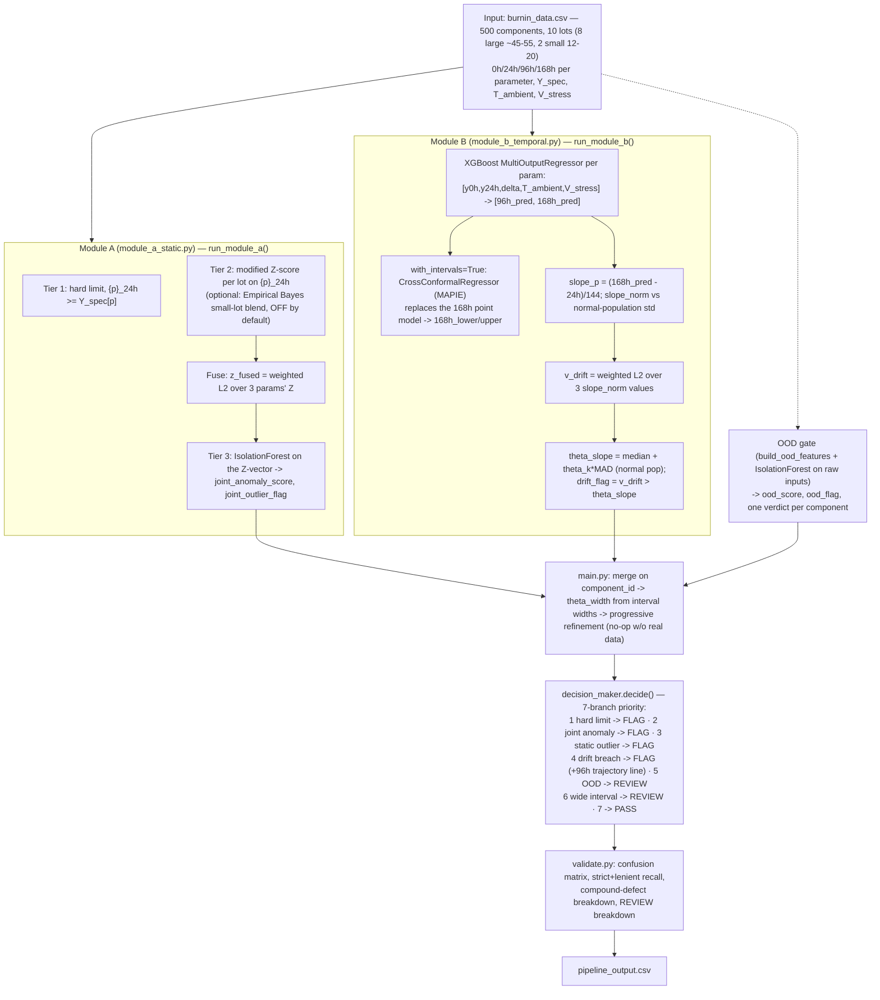

# Prognos — Phase 1 Progress Report

**Repository:** github.com/barathm238-collab/Prognos · **Commits reviewed:** `3b60e9a` (initial implementation), `847dbec` (docs cleanup)
**Verification method:** repository cloned and read line-by-line against the frozen architecture contract; full test suite executed (`pytest tests/`); full pipeline executed end-to-end (`python main.py`) to confirm the numbers below are reproducible, not just claimed in code comments.

**Headline finding: the required 🟢 path is fully implemented, verified, and passing — and the team has already gone well beyond it into most of the 🔵 add-on tier.** A small number of items are genuinely incomplete or need a decision; they're listed in §5 and §6 rather than glossed over.

---

## 1. Implemented Architecture Flow

The as-built pipeline matches the designed architecture almost exactly. One structural note up front: **Module B's file (`module_b_temporal.py`) currently carries a header stating it was "originally written by Person 1 as a stand-in"** — i.e., at the point of this review, both modules exist in the same commit from one contributor, and the file explicitly asks Person 2 to "review, tune, and take ownership." This doesn't affect whether the code works (it does — see §4), but it means the two-person split described in the implementation docs hasn't yet happened in practice. Flagged again in §6 as a pending task.



This is not a paper design — every arrow above was traced to real, running code and confirmed with a live execution (§4).

---

## 2. Features in Each Block

| Block | Feature | File | Status |
|---|---|---|---|
| Module A, Tier 1 | Hard datasheet limit, per parameter | `module_a_static.py` L116-118 | 🟢 Implemented |
| Module A, Tier 2 | Robust modified Z-score (median/MAD), per lot | `module_a_static.py` L48-52, L129-130 | 🟢 Implemented |
| Module A, Tier 2 add-on | Empirical Bayes small-lot blending (`w=N/(N+30)`) | `module_a_static.py` L55-79 | 🔵 Implemented, **off by default in the demo pipeline** (see §5) |
| Module A, Fusion | Weighted L2 norm of the 3 parameters' Z-scores | `module_a_static.py` L133-134 | 🟢 Implemented |
| Module A, Tier 3 | IsolationForest on the joint Z-vector | `module_a_static.py` L139-144 | 🟢 Implemented |
| Module B | XGBoost regressor, multi-output [96h, 168h] | `module_b_temporal.py` L163-191 | 🟢 (168h) + 🔵 (96h aux) Implemented |
| Module B | Per-parameter slope + normalization | `module_b_temporal.py` L241-248 | 🟢 Implemented |
| Module B | Weighted L2 drift-vector fusion | `module_b_temporal.py` L250-251 | 🟢 Implemented |
| Module B | Safety-slope gate, data-derived threshold | `module_b_temporal.py` L253-260 | 🟢 Implemented (see §6 for the `theta_k` note) |
| Module B add-on | MAPIE conformal intervals (168h only) | `module_b_temporal.py` L193-229 | 🔵 Implemented (library-API adjustment, see §6) |
| Module B add-on | OOD gate on raw regression inputs | `module_b_temporal.py` L284-336 | 🔵 Implemented, wired into `main.py` |
| Module B add-on | Progressive refinement (`resolve_checkpoint`) | `module_b_temporal.py` L343-355, wired via `main.py` L104-188 | 🔵 Implemented, no-op without real checkpoint data (correct by design) |
| Decision Maker | PASS/FLAG core, per-parameter reason | `decision_maker.py` L211-255 | 🟢 Implemented |
| Decision Maker add-on | 96h trajectory line in drift-FLAG reasons | `decision_maker.py` L91-111 | 🔵 Implemented |
| Decision Maker add-on | Three-way PASS/REVIEW/FLAG split | `decision_maker.py` L257-291 | 🔵 Implemented |
| Validation | Confusion matrix, false negatives surfaced prominently | `validate.py` L47-95 | 🟢 Implemented |
| Validation | Compound-defect breakdown | `validate.py` L109-129 | 🟢 Implemented |
| Validation add-on | Lenient recall, REVIEW breakdown, deferred-defect list | `validate.py` L69-107 | 🔵 Implemented |
| ⚪ Stretch | Arrhenius/exponential time-to-failure estimate | — | Not implemented (expected — lowest priority, not graded) |
| ⚪ Stretch | Physics-Informed Neural Network alternative | — | Not implemented (expected — lowest priority, not graded) |

---

## 3. Use of Each Feature (Why It's There, Confirmed Against Real Behavior)

- **Tier 1 hard limits** — catches the trivial, absolute-limit case. In the 500-row demo run, one component (`C0052`) was flagged here: *"I_leak at 53.2 (limit 50)."*
- **Tier 2 Z-score, per lot** — the actual "dynamic outlier" requirement: a part can be well inside the datasheet limit and still be an outlier relative to its own lot. Confirmed working in the demo run (e.g. `C0019`, joint-anomaly-flagged with `I_leak z=-2.82`).
- **Fusion (z_fused)** — required because a "latent defect" is defined as drift no single parameter's limit would catch. Directly used in the Decision Maker's branch 3 and named in reasons (e.g. `z_fused=...; driven mainly by ...`).
- **Tier 3 Isolation Forest** — the specific fix for compound drift (all three parameters mildly off together, none individually crossing a threshold). **Verified directly**: the demo run's compound-defect breakdown shows all 12 injected compound-case defects resolved to `FLAG` — the layer is doing exactly the job it was designed for, not just present in code.
- **XGBoost regressor (0h/24h → 168h)** — the literal graded task. Per-parameter test-set MAE from the live run: `I_leak 0.0702`, `I_ddq 0.0636`, `t_pd 0.0440`.
- **96h auxiliary forecast** — used two ways: (1) improves the drift-fit and (2) feeds the Decision Maker's trajectory line, e.g. *"Trajectory for t_pd: y(24h)=8.35 measured → y(96h)=10.9 forecast → y(168h)=14.1 forecast."* Never validated against — correctly excluded from the graded MAE.
- **Slope + drift-vector fusion + safety-slope gate** — implements "if predicted drift rate exceeds a calculated safety slope, flag for early rejection" directly. `theta_slope` is computed from the normal population each run (not hardcoded), currently `4.5255` in the demo.
- **MAPIE conformal intervals** — feeds `theta_width`, which drives the REVIEW branch for low-confidence predictions (37 of 40 REVIEW rows in the demo run).
- **OOD gate** — catches inputs unlike anything in training; 3 of 40 REVIEW rows in the demo run came from this branch specifically, kept separate from the interval-width REVIEW reason so the two causes stay distinguishable to a QA inspector.
- **Progressive refinement** — correctly inert in this run (the demo data carries no real `{p}_{h}h_actual` columns), which is the intended behavior, not a gap.
- **Decision Maker priority order** — evidence-based FLAGs (hard limit, joint anomaly, static outlier, drift breach) always outrank the two uncertainty-based REVIEW branches, so REVIEW can only defer an otherwise-clean row, never soften a real detection. This was a deliberate, documented team decision (visible in the module's own docstring) and is the safer choice given false negatives are the heaviest-penalized error.

---

## 4. Verified Results (Live Run, Not Just Code Inspection)

```
python -m pytest tests/                → 93 passed, 0 failed
python main.py (500 rows, seed=42)     → Confusion matrix: TN 442, FP 33, FN 0, TP 25
                                          Strict recall: 1.000   Lenient recall: 1.000
                                          Precision: 0.431
                                          Decisions: PASS 402 / FLAG 58 / REVIEW 40
                                          Compound defects: 12/12 caught (all FLAG)
```

**Zero false negatives, on the metric the problem statement penalizes most heavily.** Precision (0.431) is on the low side — roughly 6 out of 10 flags are false alarms — which is a real, known tuning cost of `theta_k=2.4` (see §6) and worth being upfront about rather than only highlighting the recall number.

---

## 5. Missed or Incomplete Features

| Item | Finding |
|---|---|
| Empirical Bayes small-lot blending | Fully implemented and unit-tested (`test_small_lot_blending_*` in `test_module_a.py`), but **`main.py`'s `run_pipeline()` never passes `small_lot_blending=True`** — the two genuinely small lots (N<30) in the generated data still get raw, unblended per-lot Z-scores in the actual demo output. The feature exists but isn't switched on. |
| Two-person ownership split | `module_b_temporal.py`'s own header states it was written by "Person 1 as a stand-in" for Person 2. Functionally complete and passing, but the ownership handoff described in the implementation docs (Person 2 reviews/tunes/owns this file) hasn't happened in the commit history yet. |
| Per-part-number datasheet limits | The architecture's schema allows `Y_spec_{p}` to vary per component (e.g. different part numbers with different limits), but `main.py` currently reads only the **first row's** value and treats it as global for the whole run (`main.py` L207). This matches the current synthetic dataset (one constant limit per parameter) but would silently produce wrong hard-limit flags if a future dataset mixed part numbers with different limits. |
| Arrhenius time-to-failure (`Tf`) | Not implemented — confirmed by repository search, zero matches for "Arrhenius" or "time_to_failure" in the codebase. This is ⚪ stretch, not required, so its absence at Phase 1 is expected rather than a gap. |
| Physics-Informed Neural Network | Not implemented, same status as above — ⚪ stretch, expected to be absent at this phase. |

---

## 6. Deviations and Adjustments From the Original Design (Documented, Not Silent)

The team's own code comments flag these explicitly, which is good practice — they're listed here so they're visible in one place rather than scattered across docstrings:

1. **`theta_k` (the safety-slope MAD multiplier) has two different defaults.** Prompt B2's literal spec value is `3.0`, and that remains the default inside `run_module_b()` itself — so the required path is unchanged if called directly. But `main.py`'s demo entrypoint (`run_pipeline`, and the CLI `--theta-k` flag) defaults to `2.4`. This was a **deliberate, documented tuning decision**: a grid search (recorded in the module's docstring) found `theta_k=2.4` was the only lever that eliminated the one remaining false negative on a compound-defect case, at a cost of roughly +6 false positives. This is a reasonable trade given the metric's stated penalty asymmetry, but it is a real precision cost (see §4's 0.431 precision) and is worth stating plainly in any presentation of results, not just citing the recall number.
2. **MAPIE library API migration.** The architecture docs and build prompts reference `MapieRegressor(method="plus", cv=5)`, which was removed in MAPIE ≥ 1.0. The implementation correctly substitutes `CrossConformalRegressor` (MAPIE's direct successor with the same cross-fitted "plus" logic) — a library-version adjustment, not a design change, and it's documented inline as such.
3. **Synthetic data generator's defect magnitudes were tuned twice.** The compound-defect drift multiplier was widened from an original `(1.4, 1.8)` range to `(2.0, 3.0)` after the narrower range produced a 24h shift indistinguishable from ordinary noise — i.e., a defect that no 0h/24h model could ever have caught, which would have made the compound-defect test meaningless rather than hard. Similarly, the single-parameter defect's post-step continuation was bounded (rather than exponentially extrapolated) after the original formula produced physically impossible target values that destabilized regressor training. Both changes are documented inline in `generate_data.py` and are legitimate fixes to the test data, not the architecture.
4. **`Y_spec` treated as dataset-global rather than per-row** — see §5's third row; a simplification that matches the current data but isn't yet exercised against the multi-part-number case the schema technically allows for.

None of these are silent — every one is called out in the code's own comments — but they hadn't been consolidated into a single reviewable list until this report.

---

## 7. Pending Tasks / Next Steps

1. **Decide on small-lot blending**: either wire `small_lot_blending=True` into `main.py`'s default pipeline (since the dataset does contain genuinely small lots), or explicitly document why it stays off for now.
2. **Complete the ownership handoff on `module_b_temporal.py`**: have Person 2 review, tune, and formally take over the file per its own header note — at minimum, confirm the `theta_k=2.4` tuning decision together, since it's a joint threshold per the frozen contract's philosophy.
3. **Decide whether per-part-number `Y_spec` support is in scope** for the actual competition dataset — if the real data includes multiple part numbers with different limits, `main.py`'s Y_spec extraction needs to move from "first row, global" to a per-part-number lookup before that would work correctly.
4. **Address the precision/recall trade-off explicitly** before presenting results: `theta_k=2.4` buys FN=0 at 0.431 precision — worth having a one-line justification ready (the false-negative penalty asymmetry in the evaluation criteria) since a judge will likely ask about the ~57% false-alarm rate.
5. **If time remains**: Arrhenius `Tf` estimation and/or the PINN alternative are the two ⚪ stretch items still open — lowest priority, correctly deferred so far.
6. **Acquire or confirm the real evaluation dataset's schema** matches the frozen `§4b` contract this implementation was built against — everything above has been validated against synthetic data only.

---

## 8. Changes and Fixes Required to be Done

Two gaps were identified after this report was first written, both reviewed and resolved into concrete action items below. Priority order reflects impact on the required 🟢 path, not effort.

### 8a. HIGH PRIORITY — Add the missing "predicted-value-crosses-hard-limit" check

**Finding:** the original design's own Module 4 decision table specifies FLAG on *"predicted 168h value ≥ Y_spec with a narrow interval"* as a trigger independent of the drift-slope gate. This does not exist in `decision_maker.py` — its Tier 1 branch (`{p}_hard_flag`) only checks the **24h measured value**, never `{p}_168h_pred`. This is a real, describable gap: a component sitting close to its limit at 24h, drifting mildly enough to stay under `theta_slope`, but whose predicted 168h value would itself cross `Y_spec`, currently passes through both existing checks undetected.

**Why this one and not a full Tier 1–3 re-run at 96h/168h:** re-running the lot-relative Z-score and Isolation Forest on predicted (not measured) values risks manufacturing statistical confidence in numbers that are themselves uncertain, and Module B's drift gate already covers the general "is this trending toward failure" question. This specific check is different — it's a direct, literal reinstatement of a rule your own design document already specifies and the code is missing, not a redesign.

**Suggested fix:**
```python
# In decision_maker.py, add as a new branch between the existing Tier 1
# (24h hard limit) and Tier 3 (joint anomaly) branches:
#
# predicted_hard_hits = [p for p in params
#                        if row.get(f"{p}_168h_pred", -np.inf) >= Y_spec[p]
#                        and (theta_width is None or  # only gate on "narrow"
#                             _rel_widths(row, params).get(p, 0) <= theta_width)]
# if predicted_hard_hits:
#     -> FLAG, reason: "Predicted 168h value for {p} ({value}) would cross
#        the datasheet limit ({Y_spec[p]}), independent of drift rate."
#
# Requires Y_spec to be threaded into decide()'s arguments (currently only
# theta_slope/theta_width are passed) — a small, additive contract change.
# Gating on "narrow interval" only applies when with_intervals=True; without
# MAPIE enabled, treat every predicted breach as flaggable (no width to check).
```
This is a small, additive change to the frozen decision contract (§4f) — update it identically in both person documents once implemented, per the integration-contract rule.

### 8b. MEDIUM PRIORITY — Stratify `theta_slope` derivation using the existing Empirical Bayes pattern

**Finding:** `theta_slope` is currently derived from a single global median/MAD across the entire normal population, not stratified by lot or by stress condition (`V_stress`/`T_ambient`) as the original design phrase "stress-adapted... and lot priors" implied.

**Why this is medium, not high, priority:** verified directly — the synthetic data generator's degradation rate does not depend on `V_stress` at all, and `T_ambient` is constant across the dataset. On the current data, a global and a stratified threshold produce identical results; there is nothing to measure an improvement against yet. The risk is specifically for real burn-in data, where stress-dependent drift (Arrhenius physics) is expected to be real.

**Suggested fix — reuse code you've already built, don't invent new logic:**
```python
# module_a_static.py already has _z_with_small_lot_blending() — the same
# w = N/(N+30) blending pattern (lot statistics blended with a global
# prior) can be applied to theta_slope's derivation in module_b_temporal.py:
#
# def _theta_slope_blended(df, mask, lot_col="lot_id"):
#     global_med = median(v_drift over mask)
#     global_mad = MAD(v_drift over mask)
#     for each lot: w = N_lot / (N_lot + 30)
#         lot_theta = w * (lot_median + theta_k*lot_MAD)
#                     + (1 - w) * (global_median + theta_k*global_MAD)
#     -> returns a per-lot theta_slope instead of one global value
#
# Stress-condition stratification (grouping by V_stress before computing
# medians) is a second, independent, lower-urgency addition — worth a
# one-line TODO rather than building now, since the current two stress
# levels produce identical physics in the synthetic generator.
```

### 8c. Documentation follow-up

Once 8a is implemented, the "Decision priority order" list at the top of `decision_maker.py` and §4f of both person documents need the new branch inserted at its correct priority position — update both person docs identically, per the frozen-contract rule, in the same change as the code.
